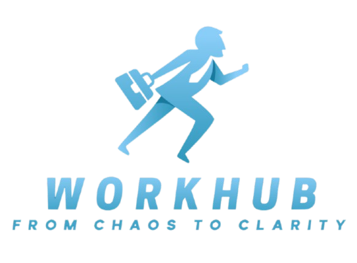
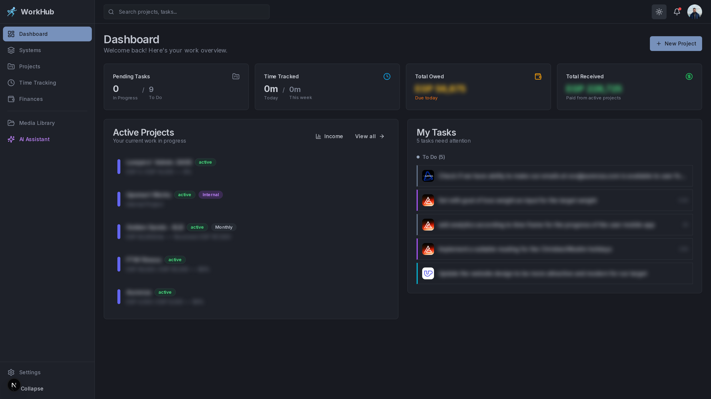
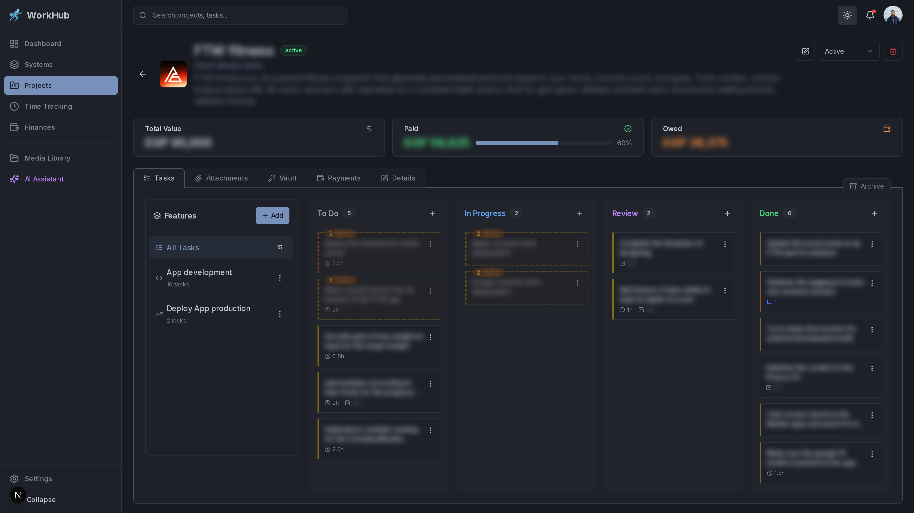
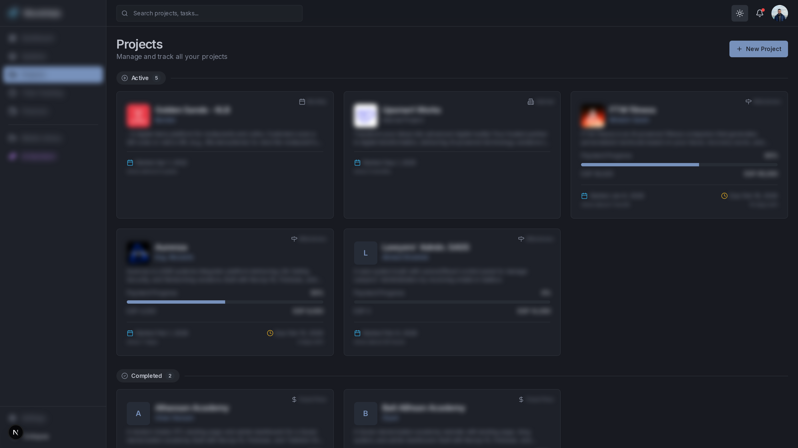
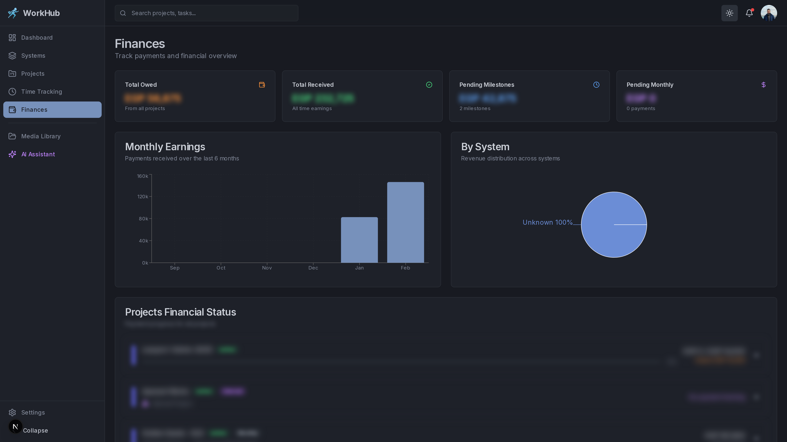
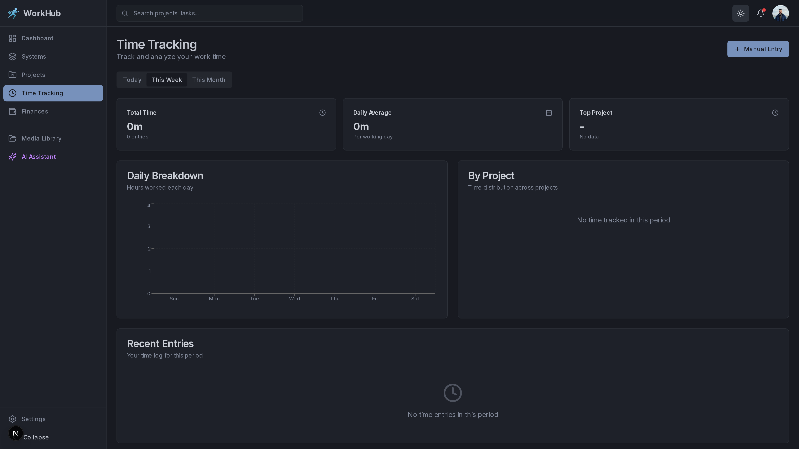
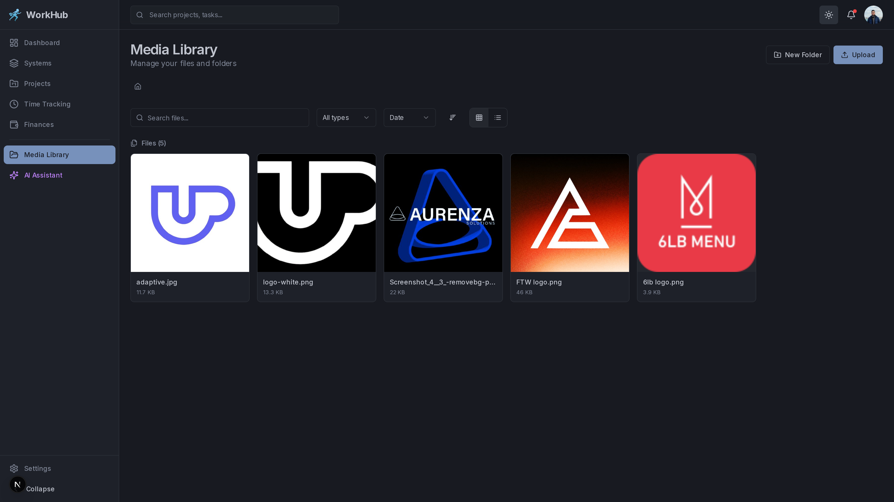
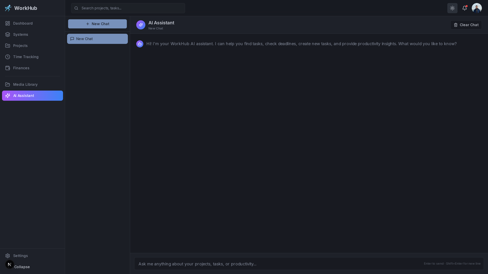

<div align="center">



# WorkHub

### The self-hosted, open-source alternative to juggling Toggl + Harvest + Notion + Trello.

**Kanban boards, live time tracking, invoicing, calendar, media library, and an AI assistant — in one app you actually own.**

[](LICENSE)
[](https://github.com/AhmedSayedSk/workhub/stargazers)
[](https://github.com/AhmedSayedSk/workhub/commits)
[](docs/CONTRIBUTING.md)
[](https://nextjs.org/)
[](https://www.typescriptlang.org/)

[ Star this repo](https://github.com/AhmedSayedSk/workhub) · [ Quick Start](#-quick-start) · [ Screenshots](#-screenshots) · [ Features](#-features)



</div>

---

WorkHub is an all-in-one, self-hosted workspace for **freelancers and small teams**. Instead of stitching together a time tracker, an invoicing app, a docs tool, and a Kanban board — each with its own login, subscription, and copy-paste tax — WorkHub puts projects, tasks, time, finances, calendar, files, and an AI assistant behind a single login on **your own Firebase project**. No per-seat pricing, no feature-gating, no vendor lock-in. Your data stays yours.

## Why WorkHub?

| | **WorkHub** | Toggl | Harvest | Notion | Trello |
|---|:---:|:---:|:---:|:---:|:---:|
| Time tracking & live timers | Yes | Yes | Yes | No | No |
| Kanban / tasks | Yes | No | No | Yes | Yes |
| Invoicing & payments | Yes | | Yes | No | No |
| Calendar | Yes | No | No | Yes | |
| Media library | Yes | No | No | Yes | No |
| AI assistant | Yes | No | No | | No |
| Self-hosted (your data) | Yes | No | No | No | No |
| Free & source-available | Yes¹ | No | No | No | No |
| All-in-one (no tool juggling) | Yes | No | No | No | No |

<sub>Yes built-in · paid tier / add-on · via third-party power-up · No not available. ¹ WorkHub is source-available and **free for personal use**; commercial use requires a license — see [License](#-license).</sub>

## Features

** Projects & Tasks**
- Multi-tier hierarchy: Systems → Projects → Features → Tasks → Subtasks
- Kanban board with drag-and-drop reordering across To Do / In Progress / Review / Done
- Color-coded task types (Task, Bug, Feature, Improvement, Docs, Research) and priorities (Low → Critical)
- Threaded comments on tasks and subtasks
- Sub-projects with shared or independent finances
- Archive clutter or flag blocked tasks as "Waiting" — orthogonal to status

**⏱ Time Tracking**
- ▶ Live timer widget — start, pause, resume, stop from anywhere in the app
- Persistent timer that survives page navigation (Zustand + localStorage)
- Manual entry for retroactive logging, down to the subtask
- Daily and weekly summaries on the dashboard

** Finance & Invoicing**
- Payment models: milestone-based, monthly, fixed-price, and internal
- Milestone tracking with pending / completed / paid statuses
- Monthly payment management with full payment history
- Know exactly what each client owes you — total owed, total received, next deadline
- Earnings visualized with interactive charts and per-project breakdowns

** Calendar & Scheduling**
- Month, week, day, and list views (FullCalendar)
- Drag-and-drop and resizable events
- Category color-coding (Work, Meeting, Deadline, Personal, Reminder) and status tracking

** Media Library**
- Folder hierarchy with breadcrumb navigation
- Drag-and-drop upload with progress tracking
- Automatic client-side image compression (configurable quality/dimensions)
- Link files to projects and tasks; grid/list views and filters

** AI Assistant** *(optional — needs a Gemini key)*
- Task breakdown — generate subtask suggestions from a feature description
- ⏳ AI-powered time/effort estimates
- Productivity insights on project health and work patterns
- Built-in web search (DuckDuckGo) and URL content fetching
- Gracefully disabled when no API key is set — everything else works without it

** Extras**
- Per-project Vault for sensitive notes, passwords, and files (passkey-protected)
- Full dark mode, responsive layout, and deep-linkable tab navigation
- Optimistic UI on every operation — instant feedback, automatic rollback on error
- Optional MCP server so AI agents (Claude and others) can drive your time tracking

## Screenshots

> Shown in dark mode. Light mode is fully supported.

| Dashboard | Kanban board |
|---|---|
|  |  |
| Active projects, pending tasks, time tracked, and finances at a glance. | Drag-and-drop tasks with color-coded priorities, types, and time estimates. |

| Projects | Finances |
|---|---|
|  |  |
| Rich project cards with progress, payment models, deadlines, and client info. | Track payments, milestones, and monthly earnings with per-project breakdowns. |

| Time tracking | Media library |
|---|---|
|  |  |
| Daily breakdowns, project distribution, and detailed time-entry logs. | Upload, organize, and link files to projects with automatic optimization. |

<p align="center">
 
 <br/>
 <sub><strong>AI Assistant</strong> — task breakdowns, time estimates, and productivity insights powered by Google Gemini.</sub>
</p>

## Quick start

**Prerequisites**
- **Node.js 22+** (see `.nvmrc`) and npm
- A **Firebase project** with Firestore, Authentication, and Storage enabled
- *(Optional)* a **Google AI Studio** API key for the AI features

**1. Clone & install**

```bash
git clone https://github.com/AhmedSayedSk/workhub.git
cd workhub
npm install
```

**2. Configure environment**

```bash
cp .env.local.example .env.local
```

```env
# Firebase (from Firebase Console → Project Settings → Your Apps)
NEXT_PUBLIC_FIREBASE_API_KEY=your_api_key
NEXT_PUBLIC_FIREBASE_AUTH_DOMAIN=your_project.firebaseapp.com
NEXT_PUBLIC_FIREBASE_PROJECT_ID=your_project_id
NEXT_PUBLIC_FIREBASE_STORAGE_BUCKET=your_project.appspot.com
NEXT_PUBLIC_FIREBASE_MESSAGING_SENDER_ID=your_sender_id
NEXT_PUBLIC_FIREBASE_APP_ID=your_app_id

# Gemini AI (optional — powers the AI assistant)
GEMINI_API_KEY=your_gemini_api_key
```

> Email notifications, Content Studio, and server monitoring have their own optional keys — see the comments in `.env.local.example`.

**3. Set up Firebase**

1. Create a project at [console.firebase.google.com](https://console.firebase.google.com/)
2. Enable **Firestore** (production mode), **Authentication** (Email/Password), and **Storage**
3. Copy `.firebaserc.example` → `.firebaserc` and set your project ID
4. Deploy the security rules and indexes:

```bash
npm run firebase:deploy:rules
npm run firebase:deploy:indexes
```

**4. Run it**

```bash
npm run dev      # dev server → http://localhost:3090
npm run build    # production build
npm start        # production server
```

Prefer containers? A dev `docker-compose.yml` (and `Dockerfile` / `Dockerfile.dev`) ship in the repo:

```bash
docker compose up
```

## Tech stack

| Category | Technology |
|---|---|
| **Framework** | [Next.js 16](https://nextjs.org/) (App Router) |
| **Language** | [TypeScript 5.7](https://www.typescriptlang.org/) |
| **UI** | [React 19](https://react.dev/) + [Radix UI](https://www.radix-ui.com/) (shadcn/ui pattern) |
| **Styling** | [Tailwind CSS 3.4](https://tailwindcss.com/) + `tailwindcss-animate` |
| **Icons** | [Lucide React](https://lucide.dev/) + [Bootstrap Icons](https://icons.getbootstrap.com/) |
| **Charts** | [Recharts](https://recharts.org/) |
| **Calendar** | [FullCalendar 6](https://fullcalendar.io/) |
| **Rich text** | [TipTap 3](https://tiptap.dev/) |
| **Diagrams** | [@xyflow/react](https://reactflow.dev/) + [dagre](https://github.com/dagrejs/dagre) |
| **Database / Auth / Storage** | [Firebase 11](https://firebase.google.com/) (Firestore, Auth, Storage) + firebase-admin |
| **State** | [Zustand 5](https://zustand-demo.pmnd.rs/) |
| **AI** | [Google Generative AI](https://ai.google.dev/) (Gemini) |
| **Dates** | [date-fns 4](https://date-fns.org/) |
| **Email** | [Nodemailer](https://nodemailer.com/) |
| **Automation** | [Model Context Protocol](https://modelcontextprotocol.io/) server (AI-agent time tracking) |

## Contributing

PRs are welcome — whether it's a bug fix, a new feature, docs, or accessibility work. Start with the [Contributing Guide](docs/CONTRIBUTING.md) for local setup (Firebase included), code style, and the PR process. By participating you agree to the [Code of Conduct](docs/CODE_OF_CONDUCT.md).

Good places to jump in:
- **Testing** — unit and integration coverage
- **Accessibility** — keyboard nav, ARIA, screen-reader support
- **Internationalization** — multi-language support
- **Mobile** — responsive polish for phones
- **Performance** — Firestore query and bundle-size wins

New here? Filter issues by **good first issue** to find a gentle starting point, or [open an issue](https://github.com/AhmedSayedSk/workhub/issues) with your question — we're happy to help. Found a security issue? See the [Security Policy](docs/SECURITY.md) for responsible disclosure.

## If WorkHub is useful to you, please star it

A star costs nothing, helps other freelancers and small teams discover the project, and genuinely motivates continued development. **[ Star WorkHub on GitHub](https://github.com/AhmedSayedSk/workhub)**

## License

Licensed under the [Sikasio Source Available License](LICENSE).

**Free for personal use.** Commercial use requires a license from Sikasio. See [LICENSE](LICENSE) for full terms.

## FAQ

<details>
<summary><strong>Is WorkHub really free?</strong></summary>
Free for personal use, learning, and non-commercial projects. Commercial use requires a license from Sikasio.
</details>

<details>
<summary><strong>Can I self-host it?</strong></summary>
Yes — that's the whole point. WorkHub runs on your own Firebase project, so your data stays on your infrastructure.
</details>

<details>
<summary><strong>Do I need the AI features?</strong></summary>
No. The AI assistant is optional and gracefully disabled without a Gemini API key. Everything else works fully without it.
</details>

<details>
<summary><strong>How is WorkHub different from Jira / Asana / Monday?</strong></summary>
It's built for freelancers and small teams, not enterprises: project management, time tracking, finances, and AI in one self-hosted place — no per-seat pricing, no feature-gating, no vendor lock-in.
</details>

---

<div align="center">


**Built by [Sikasio](https://sikasio.com)** — From Chaos to Clarity

[Report Bug](https://github.com/AhmedSayedSk/workhub/issues) · [Request Feature](https://github.com/AhmedSayedSk/workhub/issues) · [ Star on GitHub](https://github.com/AhmedSayedSk/workhub)

</div>
