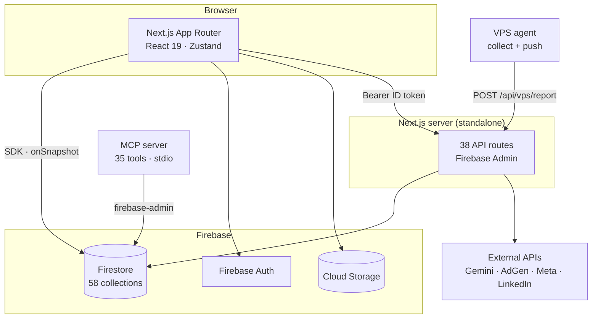
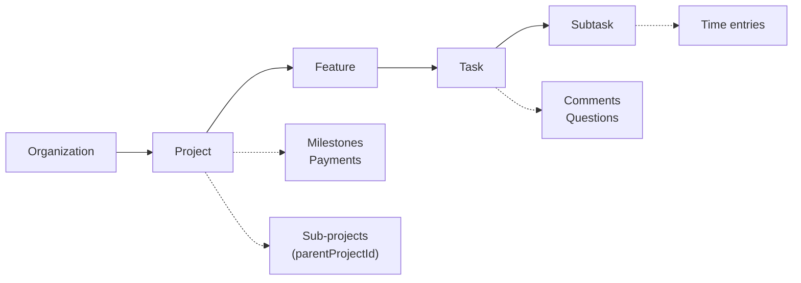
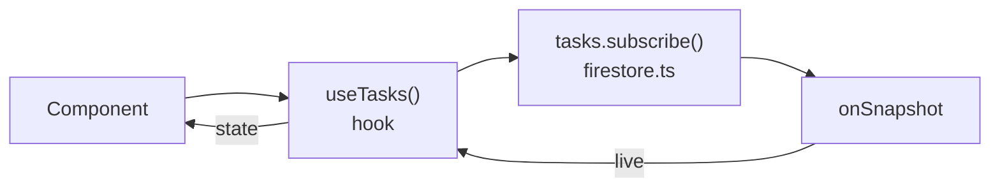
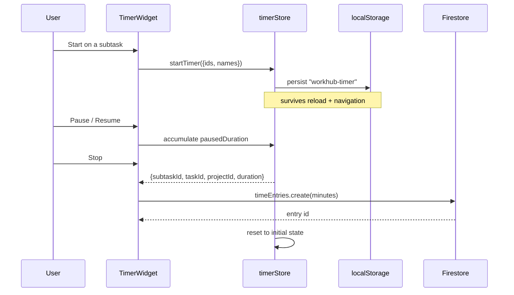
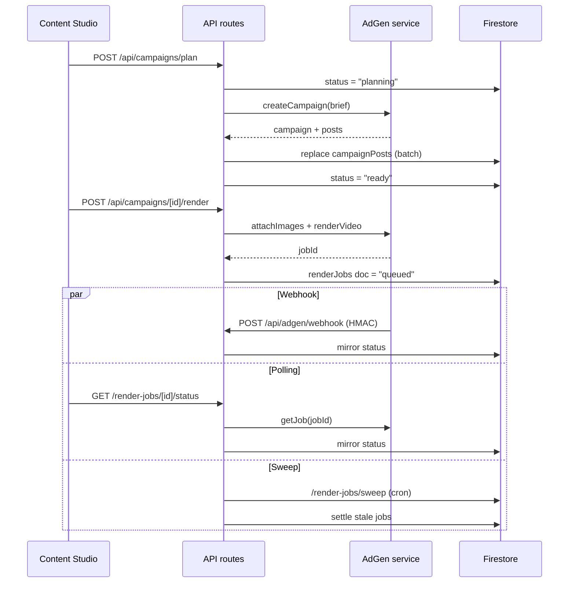
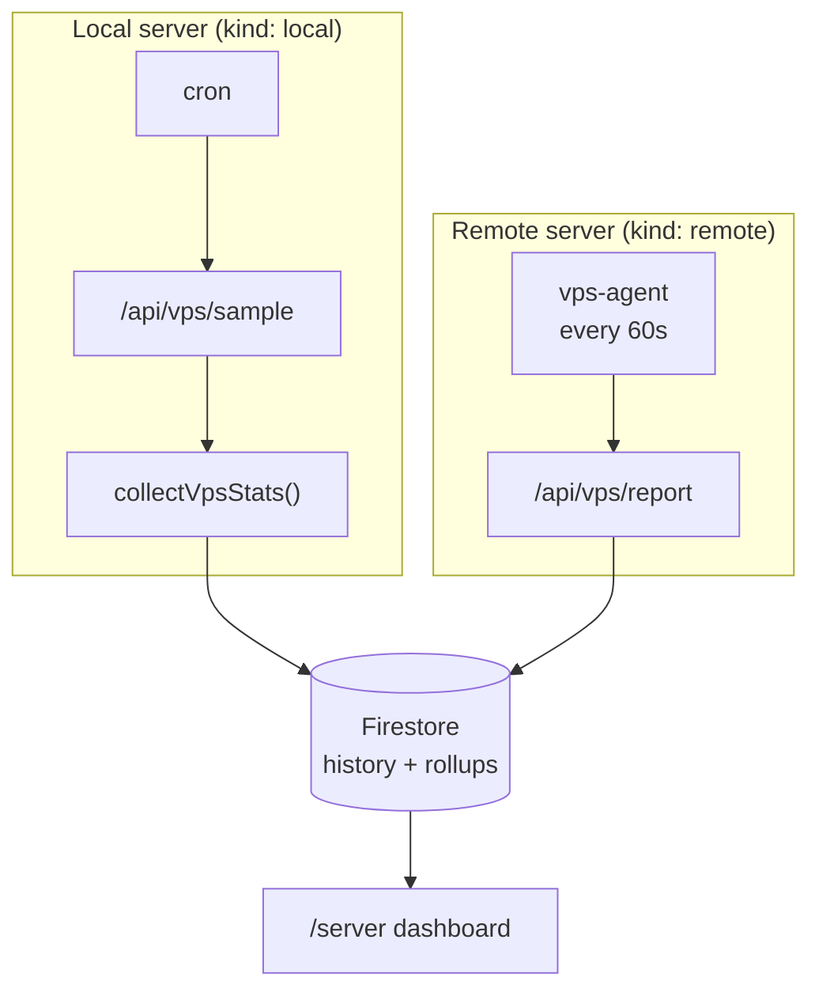

<!-- markdownlint-disable MD013 -->
# WorkHub — Architecture & System Guide

A complete map of the codebase: the four deployable pieces, the 58-collection data
model, how permissions are enforced at three separate layers, and a walkthrough of
every significant runtime flow.

| | |
|---|---|
| **Stack** | Next.js 16 (App Router) · React 19 · TypeScript 5.7 · Tailwind 3 · Firebase 11 |
| **Scale** | 412 tracked files · 19 pages · 38 API routes · 58 Firestore collections · 35 MCP tools |
| **Runtime** | Node ≥ 22 · `output: standalone` |

## Contents

1. [Orientation](#1-orientation)
2. [The four pieces](#2-the-four-pieces)
3. [Repository map](#3-repository-map)
4. [Domain model](#4-domain-model)
5. [Data access layer](#5-data-access-layer)
6. [Auth & permissions](#6-auth--permissions)
7. [Routes & modules](#7-routes--modules)
8. [Project stages](#8-project-stages)
9. [Flow — Time tracking](#9-flow--time-tracking)
10. [Flow — Campaign render](#10-flow--campaign-render)
11. [Flow — Social publishing](#11-flow--social-publishing)
12. [Flow — Server monitoring](#12-flow--server-monitoring)
13. [AI layer](#13-ai-layer)
14. [Media & storage](#14-media--storage)
15. [Email & notifications](#15-email--notifications)
16. [MCP server](#16-mcp-server)
17. [Config & deploy](#17-config--deploy)
18. [Conventions & gotchas](#18-conventions--gotchas)

---

## 1. Orientation

WorkHub is a self-hosted workspace for freelancers and small teams: projects, tasks,
time tracking, invoicing, calendar, files, and an AI assistant behind one login on
your own Firebase project.

The mental model that explains most of the code:

> **WorkHub is a thick client talking directly to Firestore.**

Nearly every read and write goes browser → Firestore over the Firebase SDK, with live
`onSnapshot` subscriptions driving the UI. There is no REST layer for ordinary CRUD.

Next.js API routes exist only where the browser *cannot* do the work itself:

- a secret must stay server-side (Gemini, AdGen, Meta, LinkedIn, SMTP),
- another machine is calling in (the monitoring agent, cron, webhooks), or
- Firebase Admin privileges are needed (creating users, resetting passwords).

That split is the single most useful thing to hold in your head while reading the tree.

---

## 2. The four pieces

One repository ships four independently deployable things. They share types and
collectors but run in different places.



| Piece | Location | Runs where | Purpose |
|---|---|---|---|
| **Web app** | `src/` | Next.js standalone | The product. App Router; most pages are client components. |
| **Firebase** | `firebase/` | Google Cloud | Auth, Firestore, Storage, security rules, indexes, migrations. |
| **MCP server** | `mcp-server/` | Local, stdio | Exposes WorkHub to AI clients. Talks to Firestore via `firebase-admin` — not the web API. |
| **VPS agent** | `vps-agent/` | Remote server | Collects host metrics and pushes them to the app on an interval. |

> **Why the agent shares code** — the agent imports the *same* framework-agnostic
> collectors the app uses for its own host (`collect.js`, `host.js`, `docker.js`),
> compiled to CommonJS at image-build time. One implementation, two callers.

---

## 3. Repository map

```text
src/app/              # App Router — 19 pages, 38 API routes
  (auth)/             #   login — unauthenticated shell
  (dashboard)/        #   everything else — sidebar + header + timer widget
  api/                #   server-only handlers
src/components/       # 126 files in 13 groups
  ui/                 #   34 shadcn/Radix primitives
  projects/           #   30 — incl. stages/ and social/
  media/ vps/ tasks/ image-generator/ layout/ …
src/lib/              # 71 files — the whole non-visual core
  firestore.ts        #   2337 lines · 58 namespaced API objects
  firebase.ts         #   client SDK init
  api-auth.ts         #   requireAuth / requireModule (Admin SDK)
  gemini.ts           #   1288 lines · every AI action
  adgen*.ts           #   campaign + render client and mirror
  server/             #   server-only: vps/ meta/ linkedin/ email/
src/hooks/            # 24 hooks — one per domain area
src/types/            # index.ts · 1597 lines · the whole domain
src/store/            # timerStore.ts — the only global client state
firebase/             # rules, indexes, migrations
mcp-server/           # 35 tools + social scheduler bridge
vps-agent/            # remote metrics pusher
```

Two conventions worth internalising:

- Anything under `src/lib/server/` must **never** be imported by a client component —
  it assumes Node APIs and secrets.
- `src/types/index.ts` is the single source of truth for the domain. There are no
  per-feature type files.

---

## 4. Domain model

A five-level work hierarchy, wrapped in a project record that carries its own
finances, permissions and lifecycle stages.



Projects self-reference through `parentProjectId`, so sub-projects form a tree. A
sub-project either rolls up into its parent's money or keeps its own, controlled by
`hasOwnFinances`.

Access is carried on the project document itself — `ownerId` plus a `sharedWith`
array of UIDs, with `pendingSharedEmails` holding invitations for people who haven't
signed up yet. Those resolve automatically on first login
(`projects.resolvePendingInvites`).

### Collections by area

All 58 are top-level (no subcollections), which keeps queries flat and rules simple.

| Area | Collections |
|---|---|
| **Identity** | `userProfiles` `members` `memberPermissions` `settings` `auditLogs` |
| **Work** | `organizations` `systems` `projects` `features` `tasks` `subtasks` `taskComments` `taskQuestions` `projectNotes` `projectLogs` |
| **Time & money** | `timeEntries` `milestones` `monthlyPayments` |
| **Files** | `mediaFolders` `mediaFiles` `vaultEntries` `imageAssets` `imageAssetFolders` |
| **Calendar** | `calendarEvents` |
| **AI & imagery** | `aiSuggestions` `imageGenerations` `imageGenSessions` `imageGenLogs` |
| **Campaigns** | `campaigns` `campaignPosts` `renderJobs` |
| **Social** | `socialPosts` `socialInsights` `adCampaigns` |
| **Stage · Next** | `nextSteps` |
| **Stage · Shape** | `projectShape` `decisions` |
| **Stage · Design** | `projectDesign` `designPrototypes` `designScreens` `designImages` |
| **Stage · Deploy** | `projectDeploy` `deployServers` `deployDomains` `deployRecommendations` |
| **Stage · Market** | `projectMarket` `marketChannels` `marketPlaybook` `marketCampaigns` `marketListings` |
| **Stage · Launch** | `projectLaunch` `launchChecklist` `launchAssets` `monitoringLinks` `postLaunchIssues` |
| **Stage · Repos** | `projectRepoGraph` `projectRepos` `repoSummaries` |

Several stage collections are **keyed by project id rather than an auto-id** —
`projectShape`, `projectMarket`, `projectLaunch`, `projectDesign`, `projectDeploy`,
`projectRepos`, `projectRepoGraph`. One document per project, so reads are a direct
`doc(id)` get with no query.

### Equity distribution

An unusual model worth calling out. `ProjectDistribution` defines weighted categories
summing to 100, and each partner holds an allocation *per category*, also summing to
100. That yields effort-based profit sharing rather than fixed percentages.

---

## 5. Data access layer

`src/lib/firestore.ts` is the whole persistence surface: 58 exported namespaces, one
per collection, each a plain object of functions.



Hooks in `src/hooks/` wrap those namespaces and own the React state — subscribe on
mount, unsubscribe on unmount, expose `{ data, loading, error }` plus mutators.
Components almost never import `firestore.ts` directly; they take the hook.

> ⚠️ **Query gotcha** — combining `where` with `orderBy` forces a composite index.
> The codebase deliberately avoids it: queries filter in Firestore and **sort
> client-side**. If you add an `orderBy` next to a `where` you will get a runtime
> error with a console link to create the index; prefer sorting in JS instead.

### Global client state

There is exactly one Zustand store: `timerStore.ts`. It is persisted to
`localStorage` under `workhub-timer`, which is what lets a running timer survive
navigation and reloads. Everything else lives in hook-local state or Firestore.

---

## 6. Auth & permissions

Three enforcement layers, deliberately overlapping. Only two of them are authoritative.

| Layer | Where | Authoritative? | Enforces |
|---|---|---|---|
| 1 · Firestore rules | `firebase/firestore.rules` | **Yes** | Project ownership and sharing, per collection. |
| 2 · API guards | `src/lib/api-auth.ts` | **Yes** | ID-token verification, then module access for route handlers. |
| 3 · UI gating | `src/hooks/usePermissions.ts` | No — cosmetic | Hides nav items, tabs and buttons the user can't use. |

### The rules model

Rules hinge on two helpers, `hasProjectAccess(projectId)` and
`isProjectOwner(projectId)`, which `get()` the project document and check
`ownerId == uid()` or `uid() in sharedWith`.

Because `get()` only works for single-document operations, **list queries fall back to
"authenticated is enough"** on child collections, with the comment in the rules file
making that explicit. The client is expected to filter by accessible projects. That is
a real trust boundary to be aware of when reasoning about multi-user exposure.

### The app owner

One UID stored at `settings/app_settings → appOwnerUid` is the superuser. It bypasses
every module check in both `requireModule` and the client hooks, and gates owner-only
routes (Audit Logs, Server).

### `requireModule(request, key)`

1. Verify the `Authorization: Bearer <idToken>` header via Firebase Admin.
2. If the UID equals `appOwnerUid`, allow.
3. Otherwise look up the member's global permission doc — `memberPermissions` where
   `projectId == "__global__"` — and require `modules[key] === true`.
4. Anything else returns `403`.

> ⚠️ **Development escape hatch** — if Firebase Admin has no credential,
> `requireAuth` and `requireModule` **allow the request through in development** and
> only hard-fail when `NODE_ENV === 'production'`. Convenient locally; worth
> remembering before assuming a route is protected in every environment.

### Permission shape

Two flat boolean records:

- **`ProjectPermissions`** — 25 keys: view/create/edit/delete across tasks, notes,
  attachments, vault, payments, activity, and time.
- **`ModulePermissions`** — 15 keys: sidebar-level capabilities such as
  `viewFinances`, `accessAiAssistant`, `accessImageGenerator`, `viewTeam`.

Both are stored per member in `memberPermissions`, with `"__global__"` as the sentinel
project id for module grants.

---

## 7. Routes & modules

### Pages

| Route | Module key | Notes |
|---|---|---|
| `/login` | — | Only route in the `(auth)` group. |
| `/` | — | Dashboard: stats, my tasks, time and finance summaries. |
| `/projects` · `/projects/new` · `/projects/[id]` | — | Detail page hosts all 8 stages plus 8 tabs. |
| `/team` | `viewTeam` | Members and permission matrix. |
| `/media` | `viewMedia` | Folder tree, uploads, previews. |
| `/audit-logs` | owner only | |
| `/time` · `/time/entries` | `viewTimesheets` | Summaries and the raw entry list. |
| `/finances` | `viewFinances` | Invoices, milestones, monthly payments. |
| `/calendar` | `viewCalendar` | FullCalendar; events plus task deadlines. |
| `/assistant` | `accessAiAssistant` | Chat with project context and web search. |
| `/content-studio` | `accessImageGenerator` | Image playground + Campaign builder. |
| `/server` · `/server/[serverId]` | owner only | Infrastructure dashboard. |
| `/settings` | `accessSettings` | |

`/image-generator` permanently redirects to `/content-studio` via `next.config.ts` —
the feature was renamed and old links still resolve.

### API routes by group

| Group | Routes | Guard |
|---|---|---|
| **AI** | `/api/ai`, `/api/ai/image` | module |
| **Campaigns** | `plan`, `[id]/hook-options`, `[id]/render` | `accessImageGenerator` |
| **Render jobs** | `[id]/status`, `[id]/cancel`, `sweep` | module / cron |
| **AdGen** | `/api/adgen/webhook` | HMAC signature |
| **Social** | `publish`, `unpublish`, `schedule`, `insights`, `cron/run`, `linkedin/oauth/*`, `linkedin/status` | module / cron secret |
| **Server** | `stats`, `report`, `sample`, `rollup`, `history`, `system-history`, `servers` | owner / agent secret |
| **Sikagit** | `projects`, `projects/[id]/repos`, `repos`, `repos/[id]`, `repos/[id]/readme` | auth |
| **Email** | `notify`, `health` | auth or `INTERNAL_API_TOKEN` |
| **Admin** | `create-user`, `reset-password`, `avatar-lookup` | owner |
| **Utility** | `web/search`, `web/fetch`, `image-proxy`, `scene-styles` | auth |

---

## 8. Project stages

The distinctive feature of the app: a project detail page that changes shape depending
on where the work is in its life.

Eight stages are declared in `PROJECT_STAGES`. Each project stores `enabledStages`, so
a simple client job might only turn on *Tasks*, while a product build enables the whole
chain. `next` is always force-included.

| Key | Label | What it holds |
|---|---|---|
| `next` | Next | AI compass — reads the whole project and proposes the highest-leverage next step. |
| `shape` | Shape | Vision, scope, and a decision log with open / decided / reversed states. |
| `design` | Design | Palette, prototypes, screens, reference images. |
| `build` | Tasks | The Kanban board. Stored key stays `build` — the label was renamed without a migration. |
| `deploy` | Deploy | Servers, domains with SSL mode, AI-generated hardening recommendations. |
| `market` | Market | Channels, playbook by launch phase, campaigns, store listings. |
| `launch` | Launch | Checklist, monitoring links, post-launch issues by severity. |
| `repos` | Repos | Repository graph rendered with React Flow + dagre layout. |

Alongside the stage strip, the page carries eight stage-independent tabs:
**workspace, calendar, notes, attachments, vault, payments, equity, activity**.
Payments and equity are permission-gated and disappear entirely for members without
`viewPayments`.

---

## 9. Flow — Time tracking



Elapsed time is **derived, never ticked into storage**: `getElapsedTime()` returns
`pausedDuration + (now − startTime)`. Pausing folds the running span into
`pausedDuration` and clears `startTime`. Stopping floors the total to whole minutes,
which is the unit `timeEntries` stores.

The widget is mounted once in the dashboard layout, outside `<main>`, so it floats
above every page. Manual and retroactive entries go straight to `timeEntries` without
touching the store.

---

## 10. Flow — Campaign render

The most intricate flow in the codebase — a long-running external job reconciled
through three independent paths so it always reaches a terminal state.



### Why three paths

A webhook can be missed, a browser tab can close, and an external render can hang.
Each path writes through the same mirror logic in `renderMirror.ts`, which is
idempotent and monotonic — `decideMirror()` returns the patch to apply or `null` for a
no-op, and `isTerminalStatus()` stops a late webhook from dragging a finished job
backwards.

| Guard | Value | Meaning |
|---|---:|---|
| `START_GRACE_MS` | 90 s | Grace before a queued job counts as stalled. |
| `MAX_RENDER_MS` | 45 min | Hard ceiling; past it the sweep fails the job. |
| `SWEEP_LIMIT` | 50 | Jobs reconciled per sweep run. |

Client polling backs off rather than hammering: `pollDelayMs(attempt)` returns a
growing delay and finally `null` to stop. Webhook deliveries are rejected outright
unless the HMAC signature verifies against `ADGEN_WEBHOOK_SECRET`.

> **Mirror, not source** — `renderJobs` is a *mirror* of state owned by AdGen.
> Firestore never originates a job status; it only reflects what the external service
> reports. That is why every writer funnels through one decision function instead of
> setting fields directly.

---

## 11. Flow — Social publishing

Posts live in `socialPosts` with a status of
`draft → scheduled → publishing → published | failed` and target three platforms:
Facebook, Instagram and LinkedIn.

1. A post is composed in the project's Social panel and saved as `draft`, optionally
   with media uploaded through `uploadSocialMedia()`.
2. Scheduling stamps a due time and moves it to `scheduled`.
3. `POST /api/social/cron/run`, authenticated by an `x-cron-secret` header, fetches
   due posts, flips each to `publishing`, and calls `publishOne()`.
4. Meta goes through the Graph API in `lib/server/meta/`; LinkedIn through
   `lib/server/linkedin/` using OAuth credentials obtained by the
   `oauth/start` → `oauth/callback` pair.
5. Results write back the platform post id, or the failure reason.

The cron route counts Instagram publishes in the trailing 24 hours before dispatching —
Instagram enforces a rolling daily publish cap, so the runner tracks it rather than
discovering the limit through API errors.

---

## 12. Flow — Server monitoring

An owner-only infrastructure dashboard that treats the machine hosting WorkHub and any
number of remote machines identically.



A registry in `servers.ts` declares each server with an `id` and a `kind`. The
`primary` entry is `local` — collected in-process. Others are `remote`, and
`/api/vps/report` rejects any `serverId` that is not both registered and remote, so an
agent cannot invent a server.

### What gets collected

`collectVpsStats()` runs seven collectors through `Promise.allSettled` so one failure
degrades that panel to `null` instead of losing the whole snapshot: **host** (CPU,
memory, disk, load), **containers**, **apps**, **storage**, **certs**, **security**
and **crons**.

Metrics are stateless on the box — everything is written to Firestore, then rolled up
for the charts. Container and app discovery reads Docker labels through a socket proxy
rather than the raw Docker socket.

### Container controls (the only write path to Docker)

The containers panel can start, stop and restart a container on the **local** server.
`POST /api/vps/containers/action` is owner-gated, and every action writes an
`auditLogs` entry of type `server`.

Reads and writes use **different** endpoints on purpose:

```text
metrics   workhub-web ──► workhub-dockerproxy         (GET only, POST: 0)
control   workhub-web ──► workhub-control-gate ──► workhub-dockerproxy-control
                          allowlist:                  CONTAINERS + POST,
                          POST /containers/<id>/       EXEC/IMAGES/VOLUMES off
                          (start|stop|restart)
```

The gate exists because the socket proxy can only authorise by API *section*:
`CONTAINERS: 1` with `POST: 1` would also permit kill, rename, create and exec-create.
The gate forwards exactly three endpoints and answers `403` to everything else, so the
grant matches the feature rather than merely containing it.

The collector lists containers with `?all=1` so **stopped ones stay visible** — Docker
returns only running containers by default, which would remove a container's row (and
its Start button) the moment it was stopped. Stats are not fetched for a non-running
container: Docker keeps echoing its last-known figures, so it would appear to still
hold memory it had already released. Those rows show `—` rather than `0 B`.

Two containers are refused outright — WorkHub's own container and the Docker proxies.
Acting on either destroys the mechanism doing the acting and can only be undone over
SSH, so the UI hides the menu and the API returns `403 protected`. The name is resolved
from the daemon before the check, never taken from the caller.

Remote servers return `501`: the agent pushes to WorkHub and exposes no inbound
channel, so there is nothing to send a command down. Adding it would mean queueing
commands in the response to `/api/vps/report`, which the agent currently discards.

> **Private overlay** — friendly names, descriptions, domains and cron labels are
> *not* in the repo. `registry.ts` loads a gitignored `vps-registry.json` at runtime
> behind a 60-second TTL cache, with `vps-registry.example.json` documenting the shape.
> Read it **per call** — snapshotting it into module constants pins whatever the first
> evaluation saw for the life of the process.

---

## 13. AI layer

All model access is server-side. `src/lib/gemini.ts` holds every prompt and parser;
`/api/ai` is a single POST endpoint that switches on an `action` field. Roughly twenty
actions are wired:

| Group | Actions |
|---|---|
| **Task intelligence** | `task_breakdown` `time_estimate` `suggest_task_icon` `generate_task_suggestion` `insight` |
| **Stage generators** | `generate_shape` `generate_shape_decisions` `generate_next_steps` `generate_deploy_recs` `generate_market_plan` `generate_market_campaigns` `generate_market_listings` `generate_market_playbook` |
| **Summarisation** | `summarize_repo` `summarize_deploy_notes` |
| **Campaigns & chat** | `campaign_plan` `campaign_brief` `ask` |

`project-context.ts` assembles the grounding payload — the project record plus its
features, tasks and stage documents — so generators answer about *this* project rather
than in the abstract.

The model is selectable from `GEMINI_MODELS` and stored in app settings. The assistant
can also reach the web through `/api/web/search` (DuckDuckGo, no key required) and
`/api/web/fetch`.

---

## 14. Media & storage

Two parallel systems, deliberately separate:

- **Media Library** (`mediaFolders` / `mediaFiles`) — a general file manager with
  folders, previews and per-project links.
- **Image assets** (`imageAssets` / `imageAssetFolders`) — belongs to Content Studio
  and holds generated imagery.

`storage.ts` handles the upload pipeline: MIME detection that doesn't trust the
browser, category classification, a 50 MB ceiling, and client-side optimisation before
upload via `optimizeImage()` with named presets. Files land in Cloud Storage under a
path derived from user, file id and name; the Firestore document holds the metadata and
the download URL.

The **Vault** (`vaultEntries`) is separate again — per-project secrets of type text,
password or file, gated by its own `viewVault` / `createEditVault` / `deleteVault`
permissions.

---

## 15. Email & notifications

Transactional mail goes through ZeptoMail with two transports. SMTP is used locally; an
HTTPS API transport is used in production because many hosts block outbound ports
25/465/587. Setting `ZOHO_MAIL_API_URL` switches modes, reusing the same credential as
the auth header.

- `notify.ts` maps domain events to recipients
- `mentions.ts` resolves `@` mentions in comments to users
- `templates.ts` renders the messages

`/api/email/notify` accepts either a signed-in user's token **or** the shared
`INTERNAL_API_TOKEN`, which is how the MCP server sends mail without a user session.
`/api/email/health` reports transport status.

In-app notification state is handled by `useNotifications()`, mounted once in the
dashboard layout, with optional browser notifications through the Notifications API.
`useOfflineDetector()` renders the offline banner in the same layout.

---

## 16. MCP server

A stdio Model Context Protocol server exposing 35 tools so an AI client can operate
WorkHub directly. It connects to Firestore through **firebase-admin** — it does not
call the web API — so it works without the app running.

| Group | Tools |
|---|---|
| Projects & tasks | `list_projects` `list_tasks` `create_task` `get_task_details` `update_task_status` `update_task_assignees` `list_members` |
| Time | `start_timer` `stop_timer` `get_timer_status` `log_time` `get_time_summary` `list_time_entries` `update_time_entry` `delete_time_entry` |
| Comments & questions | `add/update/delete_task_comment` · `list/add/update/delete_task_question` |
| Social | `create/list/update/cancel_social_post` · `set/list_social_accounts` |
| Campaigns | `list_campaigns` `get_campaign` `update_campaign_post` `schedule_campaign` |
| Scheduler bridge | `list_scheduled_posts` `scheduler_status` `run_scheduler` |

The scheduler bridge reads local campaign folders on disk. Which campaigns exist is
**not** in the repo: `loadCampaigns()` looks for `SOCIAL_CAMPAIGNS_CONFIG`, then
`social-campaigns.json` in the working directory, then next to the module — and returns
an empty list if none is found. `social-campaigns.example.json` documents the shape.

---

## 17. Config & deploy

### Environment

| Group | Keys |
|---|---|
| Firebase client | `NEXT_PUBLIC_FIREBASE_*` — api key, auth domain, project id, bucket, sender, app id |
| Firebase admin | `FIREBASE_SERVICE_ACCOUNT_JSON`, or a local `firebase-service-account.json` |
| AI | `GEMINI_API_KEY` |
| Campaigns | `ADGEN_API_BASE` `ADGEN_API_KEY` `ADGEN_WEBHOOK_SECRET` |
| Images | `IMG_GEN_API_BASE` `IMG_GEN_API_KEY` |
| Social | `META_SYSTEM_TOKEN` `META_PAGE_ID` `META_IG_USER_ID` `META_AD_ACCOUNT_ID` `META_CRON_SECRET` |
| Email | `ZOHO_MAIL_*` `NEXT_PUBLIC_APP_URL` |
| Internal | `INTERNAL_API_TOKEN` — MCP and agent callers |
| Server dashboard | `VPS_*` triples per server, `VPS_REGISTRY_FILE` |

Secret-backed features **fail loudly by design** — `ADGEN_API_BASE` and
`ADGEN_API_KEY` have no defaults and no fallback, so a missing value produces a clear
error rather than a silent degradation.

### Build

Output is `standalone` for a slim Docker image. `experimental.cpus = 1` is deliberate:
builds run on a small production box shared with live services, and one worker keeps a
core free so a deploy never starves them.

### Tests

The Node built-in runner with native TypeScript stripping:

```bash
npm test    # node --experimental-strip-types --test "src/**/*.test.ts"
```

Coverage concentrates on the pure logic that is hardest to verify by clicking: the
render mirror's decision and settle functions, poll backoff, certificate-domain
parsing, card metrics, and the server registry.

### Scripts

| Command | Does |
|---|---|
| `npm run dev` | Next dev server on port 3090 (webpack) |
| `npm run build` / `start` | Production build and serve |
| `npm run lint` | ESLint |
| `npm test` | Node test runner |
| `npm run firebase:deploy:rules` | Deploy Firestore rules only |
| `npm run firebase:deploy:indexes` | Deploy indexes only |
| `npm run migrate` | Run `firebase/migrations` |

---

## 18. Conventions & gotchas

**Public repository.** This repo is public. No infrastructure identifiers, client or
system names, real local paths, or secrets — in code, comments, example files **or
commit messages**. Curated private data goes in a gitignored file with a tracked
`.example` alongside it (`vps-registry.json`, `mcp-server/social-campaigns.json`).

**Sorting over indexes.** Don't pair `where` with `orderBy`. Filter in Firestore, sort
in JavaScript.

**Server-only imports.** Nothing under `lib/server/` may be pulled into a client
component. It assumes Node APIs and reads secrets.

**Types live in one file.** `src/types/index.ts` is the domain. Add there, not in
feature folders.

**UI system.** shadcn/Radix primitives in `components/ui/`, Lucide icons, Tailwind with
the `cn()` helper. Forms are single-page, not wizards.

**Renamed, not migrated.** Some labels drifted from their stored keys — the *Tasks*
stage is still `build`, and Content Studio still redirects from `/image-generator`.
Trust the key, not the label.
